# 🧠⚡ Autonomous Trash Collector - SNN Evolutionary AI Testbed

**An experimental AI project testing Spiking Neural Networks (SNN) in complex multi-agent environments using evolutionary algorithms.**

## 📌 Overview
This project simulates autonomous agents with hybrid neural architectures (MLP + SNN) that learn to collect trash efficiently while managing limited battery resources. It serves as a testbed for:
- Evolutionary training methods
- Spiking Neural Networks in complex environments
- Multi-agent reinforcement learning dynamics
- Memory-augmented navigation strategies

## 🌟 Key Features
| Feature | Description |
|---------|-------------|
| **Evolutionary Core** | Population-based training with performance-based selection and adaptive mutation |
| **Hybrid NN Architecture** | Combines traditional dense layers with spiking neurons (Leaky Integrate-and-Fire) |
| **Enhanced Memory System** | Spatial memory that prioritizes critical objects (chargers/trash) |
| **Hierarchical Rewards** | Multi-level reward system promoting strategic behavior |
| **Competitive Modes** | Configurable for both competitive and cooperative scenarios |

## 🧩 Technical Components
# Neural Architecture Diagram

```mermaid
graph LR
    Input[Input<br>22+4×MEMORY_SIZE] 
    --> Norm[LayerNorm]
    --> Dense[Dense<br>512]
    --> Act[LeakyReLU]
    --> Attention[MultiheadAttention]
    --> Residual[Residual Blocks<br>256→128→64]
    --> SNN[SNN Layers<br>64→64→32→32]
    --> Output[Output<br>5 actions]
```

## 🚀 Getting Started
Prerequisites
Python 3.8+

PyTorch 2.0+

SNNTorch

PyGame (for rendering)

Numpy

Installation
bash
Copy
git clone https://github.com/monokatarina/IA_in_complex_game_snn
cd IA_in_complex_game_snn
pip install -r requirements.txt
Basic Usage
python
Copy
# Updated usage examples to reflect the new MVC structure
from controllers.training_controller import EvolutionaryTrainer

# Initialize with 10 AI agents
trainer = EvolutionaryTrainer(
    population_size=10,
    with_curiosity=True,  # Enable intrinsic motivation
    render=True           # Visualize training
)

# Run evolution for 1000 episodes
trainer.train(total_episodes=1000)

📊 Performance Metrics
Training Progress
Sample training curve showing reward progression across generations

📜 License
MIT License - See LICENSE for details.

🛠 Roadmap
Add predator-prey dynamics

Implement transfer learning between agents

Develop dynamic environment scaling

Integrate neuromorphic hardware support

🤝 Contributing
PRs welcome! Please see:

Contribution Guidelines

Code of Conduct
